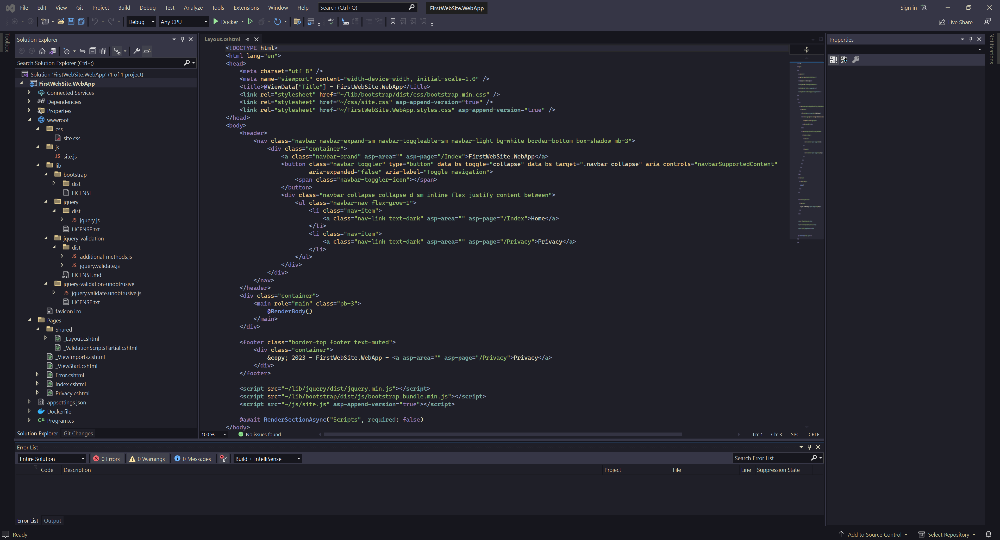

# Kanagawa Visual Studio Theme

  

Theme for Visual Studio inspired by the colors of the famous painting by Katsushika Hokusai.

  <h2 align="center">
    
   </h2>

## Credit

Tommaso Laurenzi https://github.com/rebelot/kanagawa.nvim

## Todo

- [ ] Create all variations

## Source

https://github.com/king8fisher/kanagawa_vs_theme

